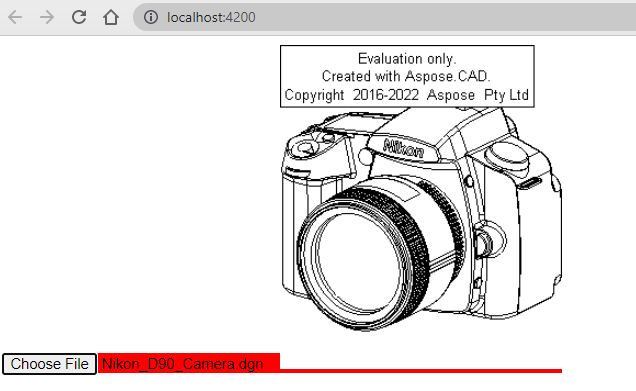

## Prerequisites
- Angular CLI
- Visual Code
- Node.js

## Convert dgn image to png and display in browser

In this example, you create a simple conversion program that converts a drawing and saves it as an image.

## Creating the Angular Project

1. Ensure that you aren't already in an Angular workspace directory.
1. Start a new one and then the name of the program or use other programs to create a project such as Visual Code or WebStorm:

ng new angular-example

1. Install Aspose.CAD from npm package

npm install aspose-cad

1. Open the angular.json file and add an entry in the script field, this script starts loading with the project, it is required to start processing the files

"scripts": [
  "node_modules/aspose-cad/dotnet.js"
]

1. In app.component.html, create an input type file and img tags to load and display the drawing


    <input type="file" class="file-upload" (change)="onFileSelected($event)" />
    


1. In app.component.ts, we describe the process of starting the helper processes, processing and saving the image

import {Component} from '@angular/core';
import {DomSanitizer} from '@angular/platform-browser';
import {Image} from "aspose-cad/commonjs/Core/Image";
import {PngOptions} from "aspose-cad/commonjs/Options/PngOptions";

//need to boot dotnet process
declare let dotnet: any;
@Component({
  selector: 'app-root',
  templateUrl: './app.component.html',
  styleUrls: ['./app.component.css']
})
export class AppComponent {
  title = 'angular-example';

  imageUrl: any;
  imgFile: Uint8Array | null | undefined;

  constructor(private sanitizer: DomSanitizer) {
  }

  // @ts-ignore
  async ngOnInit() {
    console.log("aspose-cad WASM loading...");
    await dotnet.boot().then((ex: any) => {
      console.log("aspose-cad WASM has been loaded");
    });
  }

  // @ts-ignore
  async onFileSelected(event) {

    const file: File = event.target.files[0];
    file.arrayBuffer().then(async buff => {
      let x = new Uint8Array(buff);
      
      this.imgFile = await Image.Load(x); //Load image
      console.log(this.imgFile);
      var exportedFile = await Image.Save(this.imgFile, new PngOptions()); //save image to png

      var urlCreator = window.URL || window.webkitURL;
      var blob = new Blob([exportedFile], { type: 'application/octet-stream' });
      
      //create src for converted image
      this.imageUrl = this.sanitizer.bypassSecurityTrustUrl(urlCreator.createObjectURL(blob));

      //download png image
      let url = window.URL.createObjectURL(blob);
      let a = document.createElement('a');
      document.body.appendChild(a);
      a.setAttribute('style', 'display: none');
      a.href = url;
      a.download = "file.png";
      a.click();
      window.URL.revokeObjectURL(url);
      a.remove();

    });
  }
}

1. Start application

npm start
//or
ng serve

{} 
The ng serve command:

- Builds the application
- Starts the development server
- Watches the source files
- Rebuilds the application as you make changes

The --open flag opens a browser to http://localhost:4200.
{}

## Execution example

1. Choose file. 
 
1. Select any DXF, DWG, DGN, DWF, DWFX, IFC, STL, DWT, IGES, PLT, CF2, OBJ, HPGL, IGS, PCL, FBX, PDF, SVG file.
1. If the answer is successful, the file will be displayed on the screen and will offer to download it. 
 

## See Also

- [Install Angular CLI](https://angular.io/guide/setup-local/)
- [Install Visual Code](https://code.visualstudio.com/)
- [Install Node.js](https://nodejs.org/en/)