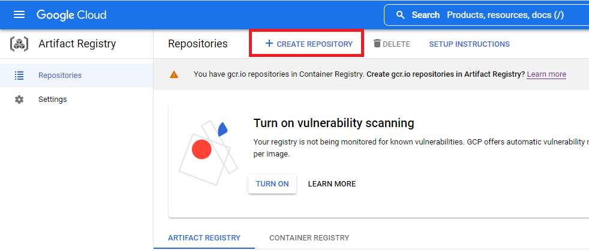
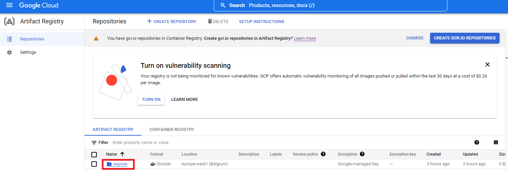
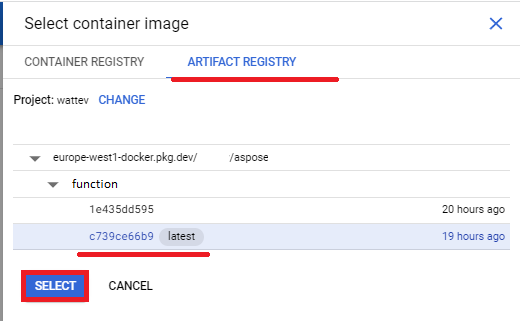
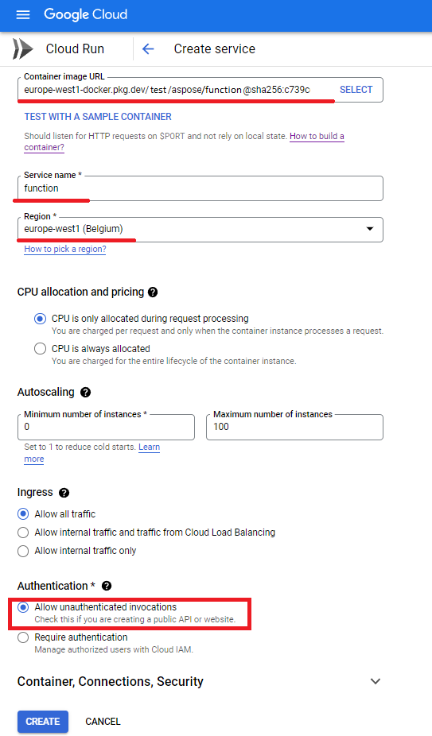
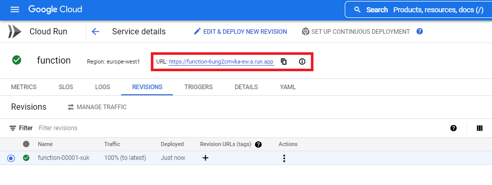

## Prerequisites

- Docker must be installed on your system. For information on how to install Docker on Windows or Mac, refer to the links in the “See Also” section.
- Visual Studio 2022.
- Google CLI.
- NET Core 3.1 SDK is used in the example.
- Postman

## Google Cloud Run Function

Cloud Run is a fully-managed compute environment for deploying and scaling serverless HTTP containers without worrying about provisioning machines, configuring clusters, or autoscaling.

- No vendor lock-in - Because Cloud Run takes standard OCI containers and implements the standard Knative Serving API, you can easily port over your applications to on-premises or any other cloud environment. 
- Fast autoscaling - Microservices deployed in Cloud Run scale automatically based on the number of incoming requests, without you having to configure or manage a full-fledged Kubernetes cluster. Cloud Run scales to zero— that is, uses no resources—if there are no requests.
- Split traffic - Cloud Run enables you to split traffic between multiple revisions, so you can perform gradual rollouts such as canary deployments or blue/green deployments.
- Custom domains - You can set up custom domain mapping in Cloud Run and it will provision a TLS certificate for your domain. 
- Automatic redundancy - Cloud Run offers automatic redundancy so you don’t have to worry about creating multiple instances for high availability.

Cloud Run and Cloud Functions are both fully managed services that run on Google Cloud’s serverless infrastructure, auto-scale, and handle HTTP requests or events. They do, however, have some important differences:

- Cloud Functions lets you deploy snippets of code (functions) written in a limited set of programming languages, while Cloud Run lets you deploy container images using the programming language of your choice. 
- Cloud Run also supports the use of any tool or system library from your application; Cloud Functions does not let you use custom executables. 
- Cloud Run offers a longer request timeout duration of up to 60 minutes, while with Cloud Functions the requests timeout can be set as high as 9 mins. 
- Cloud Functions only sends one request at a time to each function instance, while by default Cloud Run is configured to send multiple concurrent requests on each container instance. This is helpful to improve latency and reduce costs if you're expecting large volumes. 

## Creating the Google Cloud Function project

{} 
Make sure you have sufficient rights to create Google Cloud Run function and images in the Artifact Registry repository.
{}

To create the Google Cloud Function program, follow the steps below:

1. Install .NET Core SDK 3.1.
1. Install the template package:

dotnet new -i Google.Cloud.Functions.Templates

1. Next, create a directory for your project, and use dotnet new to create a new HTTP function:

mkdir AsposeFunctions //create folder
cd AsposeFunctions //go to folder AsposeFunctions
dotnet new gcf-http //create Google Cloud Function project with http trigger

{} 
This creates AsposeFunctions.csproj and Function.cs in the current directory. Open Function.cs to review the code, and provide a custom message if you want.
{}
1. Code example for csproj file(AsposeFunctions.csproj).

<Project Sdk="Microsoft.NET.Sdk">
  <PropertyGroup>
    <OutputType>Exe</OutputType>
    <TargetFramework>netcoreapp3.1</TargetFramework>
  </PropertyGroup>

  <ItemGroup>
    <PackageReference Include="Aspose.CAD" Version="22.7.0" />
    <PackageReference Include="Google.Cloud.Functions.Hosting" Version="1.0.0" />
  </ItemGroup>
</Project>

1. Code example for convert cad image to png file(Function.cs).

namespace AsposeFunctions
{
    public class Function : IHttpFunction
    {
        /// 

        /// Logic for your function goes here.
        /// 

        /// <param name="context">The HTTP context, containing the request and the response.</param>
        /// <returns>A task representing the asynchronous operation.</returns>
        public async Task HandleAsync(HttpContext context)
        {
            try
            {
                //var file = context.Request.Form.Files.FirstOrDefault(); //form file
                var file = context.Request.Body; //binary data
                
                var msFile = new MemoryStream();
                await file.CopyToAsync(msFile);
                msFile.Seek(0, SeekOrigin.Begin);
                
                using (var image = (CadImage)Image.Load(msFile))
                {
                    var ms = new MemoryStream();
                    image.Save(ms, new PngOptions());
                    ms.Seek(0, System.IO.SeekOrigin.Begin);

                    context.Response.Headers.Add("Content-Type", "image/png");
                    context.Response.Headers.Add("Content-Disposition", "attachment;filename=result.png");

                    await context.Response.Body.WriteAsync(ms.ToArray(), 0, ms.ToArray().Length);
                }
            }
            catch (Exception e)
            {
                await context.Response.WriteAsync(e.Message);
            }
        }
    }
}

1. Build your function locally as follows:

dotnet run

1. Once the server is running, browse to http://localhost:8080 to invoke the function. Press Ctrl-C in the console to stop the server.

## Deploy docker image to Google Cloud

1. Log in Google Cloud.
1. Create a project if it doesn't exist.
1. Go to 'Artifact Registry' and create a repository. 
 
1. Select new repository in Artifact Registry.
 
1. Click 'SETUP INSTRUCTION' and copy 'Configure Docker' command. 
 
1. Add a Docker credHelper entry to Docker's configuration file, or creates the file if it doesn't exist.

//example
gcloud auth configure-docker {region}-docker.pkg.dev

gcloud auth configure-docker europe-west1-docker.pkg.dev

1. Create a Dockerfile in the project root directory and edit the DockerFile as in the <a href="#configuring-a-dockerfile">Configuring a Dockerfile</a> section.
1. Start Docker Desktop.
1. Build docker image with cloud repository path.

//example
docker build -t {region}-docker.pkg.dev/{project-name}/{repository-name}/{any-name}:{tag} .

docker build -t europe-west1-docker.pkg.dev/test/aspose/function:latest .

1. Push image to Google Cloud Artifact Registry

//example
docker build -t {region}-docker.pkg.dev/{project-name}/{repository-name}/{any-name}:{tag} .

docker push europe-west1-docker.pkg.dev/test/aspose-cloud/function:latest


## Create Google Gloud Run service 

1. Go to Cloud Run.
1. Create Cloud Run service. 
 
1. In the Container Image URL field, select the container from'ARTIFACT REGISTRY'. 
 
1. Сheck other settings as below. 
 
1. Wait for the deployment to finish.
1. Service URL to work with the conversion application. 
 

### Configuring a Dockerfile

 The next step is to edit configure the Dockerfile in project.

1. In the Dockerfile, specify:


FROM mcr.microsoft.com/dotnet/core/sdk:3.1 AS build
WORKDIR /build
COPY . .
RUN dotnet restore
RUN dotnet publish -c Release -o /app

FROM mcr.microsoft.com/dotnet/core/aspnet:3.1 AS final
WORKDIR /app
COPY --from=build /app .

RUN apt-get update
RUN apt-get install -y apt-utils
RUN apt-get install -y libgdiplus
RUN apt-get install -y libc6-dev 
RUN ln -s /usr/lib/libgdiplus.so/usr/lib/gdiplus.dll

EXPOSE 8080
ENV ASPNETCORE_URLS=http://*:8080
ENV ASPNETCORE_ENVIRONMENT=Release
ENV TAPTAKE_SEED=false
ENTRYPOINT ["dotnet", "AsposeFunctions.dll"]


 The above is a simple Dockerfile, which contains the following instructions:

- The SDK image to be used. Here it is the Net Core 3.1 image. Docker will download it when the build is run. The version of SDK is specified as a tag.
- After, you may need to install Fonts because the SDK image contains very few fonts. Also, you can use local fonts copied to docker image.
- The working directory, which is specified in the next line.
- The command to copy everything to container, publish the application, and specify the entry point.

## Execution example

1. Postman settings. 
 
1. Select any DXF, DWG, DGN, DWF, DWFX, IFC, STL, DWT, IGES, PLT, CF2, OBJ, HPGL, IGS, PCL, FBX, PDF, SVG file.
1. Click the send button.

{} 
If the answer is successful, click Save to file and you will receive the converted file in png format
{}

## More Examples

For more samples of how you can use Aspose.CAD in Docker, see the [examples](https://github.com/aspose-cad/Aspose.CAD-Documentation).

## See Also.

- [Install Docker Desktop on Windows](https://docs.docker.com/docker-for-windows/install/)
- [Install Docker Desktop on Mac](https://docs.docker.com/docker-for-mac/install/)
- [Visual Studio 2022, NET Core 3.1 SDK](https://docs.microsoft.com/en-us/dotnet/core/install/windows?tabs=netcore31#dependencies)
- [ Google Cloud CLI](https://cloud.google.com/sdk/docs/install)
- [Switch to Linux containers](https://docs.docker.com/docker-for-windows/#switch-between-windows-and-linux-containers) option
- Additional information on [.NET Core SDK](https://hub.docker.com/_/microsoft-dotnet-sdk)